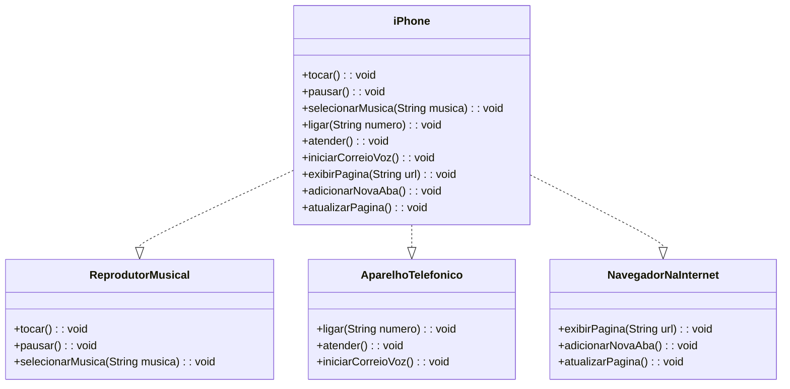

# Diagrama UML referente a atividade:
https://github.com/digitalinnovationone/trilha-java-basico/tree/main/desafios/poo

```mermaid
classDiagram
    class ReprodutorMusical {
        +tocar(): void
        +pausar(): void
        +selecionarMusica(String musica): void
    }

    class AparelhoTelefonico {
        +ligar(String numero): void
        +atender(): void
        +iniciarCorreioVoz(): void
    }

    class NavegadorNaInternet {
        +exibirPagina(String url): void
        +adicionarNovaAba(): void
        +atualizarPagina(): void
    }

    class iPhone {
        +tocar(): void
        +pausar(): void
        +selecionarMusica(String musica): void
        +ligar(String numero): void
        +atender(): void
        +iniciarCorreioVoz(): void
        +exibirPagina(String url): void
        +adicionarNovaAba(): void
        +atualizarPagina(): void
    }

    iPhone ..|> ReprodutorMusical
    iPhone ..|> AparelhoTelefonico
    iPhone ..|> NavegadorNaInternet
```
